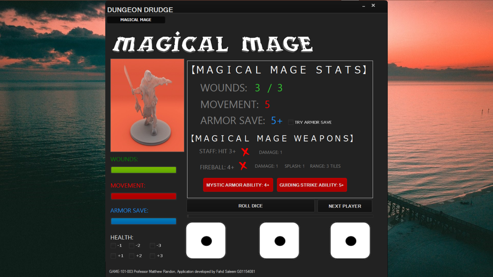

# DUNGEON DRUDGE 

DungeonDrudge is a project developed apart of my game design university course my freshman year. 



## Description

The application is intended to be used alongside the physical board game to aid in keeping track of crucial game metrics, functions such as rolling dice, and much more to enhance the game experience. The application is highly functional, making use of multiple classes. The application is visually appealing and has a very intricate GUI with which users can interact to facilitate their game experience. The application keeps track of multiple players, their damage, armor, and other vital statistics to facilitate the physical game created by my team and I being DungeonDrudge. 

## Getting Started

### Dependencies

* The following application is a Windows executable. Not intended for any other platform.
* Windows 10 or above. Microsoft Visual Studio with Visual Basic .NET dependencies installed.

### Installing
* Download the executable file or clone the repository. 

```
git clone https://github.com/cfahd/dungeondrudge.git
```

### Executing program

* Run the executable file or open the project in Microsoft Visual Studio to build. 

## Authors

Contributors names and contact info

Developer: [@cFahd](https://github.com/cfahd/)

## Version History

* 0.1
    * Various bug fixes and optimizations
    * See [commit change]() or See [release history]()

## License

This project is licensed under cFahd - see the LICENSE file for details
